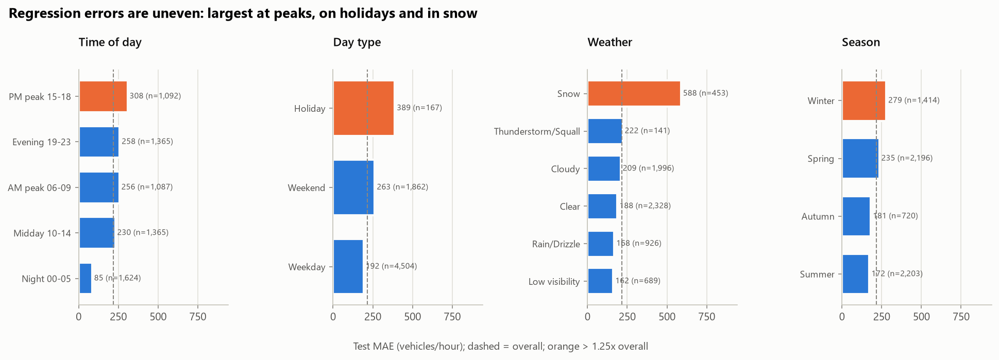
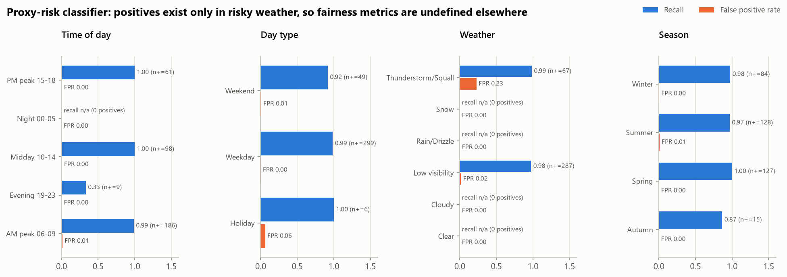

# Bias, Fairness, Governance and Sustainability Report

**Capstone Part 3 · I-94 Traffic Intelligence Solution**

All figures below come from `fairness_analysis.py`, `monitoring/monitoring.py` and `explainability.py`. The source tables are in
`reports/metrics/` (files starting `fairness_`, `sustainability_` and `shap_`), and the charts are in `figures/task7_responsible_ai/`.

> **Accident data statement.** No real accident dataset was sourced. The classification model predicts a documented
> **proxy** label (`high_risk`), defined exactly as the capstone brief specifies. Nothing in this project predicts real accidents.

---

## Part A: Bias and fairness

### A1. Sampling and coverage limitations

| Limitation | Evidence | Consequence |
|---|---|---|
| **Single sensor, single direction** | All 48,204 raw rows come from one westbound I-94 station (ATR 301, between Minneapolis and St Paul). | Nothing can be said about other corridors, eastbound traffic, local roads, cyclists, pedestrians or public transport. The recommender only optimises *timing* on this road. |
| **Uneven temporal coverage** | Hours observed ÷ hours expected: 2012 96%, 2013 83%, **2014 51%**, **2015 41%**, 2016 89%, 2017 99%, 2018 100%. The largest gap is **7,386 hours (~10 months)**, ending 11 June 2015. A further 2,588 shorter gaps exist, 2,452 of them ≤ 3 h. | Mid-2014 to mid-2015 is effectively missing, so the models under-represent that period's conditions (e.g. a full winter). Training weights 2016–17 most heavily. |
| **Rare conditions** | Fog 201 hours, Smoke 15, Squall 1; only **53 holiday days** in six years; 2,297 snow hours. | Estimates for these conditions rest on few examples. Holiday and snow errors are the largest in the system (A3). |
| **Weather is simplified** | Part 2 kept one weather row per hour and dropped 7,612 secondary-condition rows. `clouds_all` switched to five rounded values ({1, 20, 40, 75, 90}) from 2017. | Mixed conditions (e.g. "rain + mist") are reduced to one label. The cloud-cover change silently alters a model input (detected in monitoring, A3). |
| **Imputed values** | 10 temperatures, 1 rainfall value and 47 sensor-outage traffic counts were imputed in Part 2. The LSTM also interpolated 2,771 short-gap hours, as inputs only. | Imputation is small and flagged (`traffic_volume_imputed`), but those hours carry less reliable information. |
| **Demand, not safety or equity** | Volume is a count of vehicles. It does not describe who travels, why, or with what alternatives. | "Low-traffic" recommendations favour people with flexible schedules. Shift workers and carers often cannot move their journeys. |

### A2. Proxy label and its risks

**Definition (from the brief):** `high_risk = congestion_category ∈ {High, Severe} AND (weather_main ∈ {Thunderstorm, Squall} OR low-visibility weather ∈ {Mist, Fog, Haze, Smoke})`.
It flags 1,927 of 40,575 hours (4.75%).

| Risk | Evidence | Why it matters |
|---|---|---|
| **Circularity** | The label is a deterministic function of two model inputs (weather, and hour-driven congestion). Every model scores ROC AUC ≥ 0.999. A two-condition rule with no ML ("risky weather AND 06:00–18:59") already reaches **F1 0.885**, against 0.954 for the best model. SHAP gives **61%** of the classifier's attribution to the label-defining weather features (`is_low_visibility` 45%, `weather_Thunderstorm` 9%, `weather_severity` 7%) and a further 22% to `hour_cos`. | Near-perfect scores reflect how the label was built, not skill at predicting danger. Reporting them as "accident prediction accuracy" would be misleading. |
| **Structural blind spots** | The positive rate is **exactly 0** for clear, cloudy, rain/drizzle and snow hours, and for every night hour (00–05). **63%** of all positives are Mist. | The model can never flag risk in snow, freezing rain or on dark, empty roads, all conditions associated with real crashes. A deployed "risk" score would give false reassurance in exactly those cases. |
| **Labelling choices shift the label** | If the secondary weather conditions dropped in Part 2 were kept, **1,332 more hours** would be positive (**+69%**). | An upstream data-cleaning decision changes what "risk" means by two-thirds. Proxy labels are highly sensitive to pipeline choices. |
| **Unstable over time** | The yearly positive rate ranges from **1.8% (2014) to 7.4% (2012)**, and is higher in winter (7.0%) than in other seasons (≈ 4%). | Some of this reflects sparse coverage and changing weather-feed coding rather than real changes in hazard. |
| **Congestion ≠ danger** | High volume often means slower speeds. Severe crashes are frequently associated with free-flow, night-time or icy conditions. | The proxy may point attention away from the most dangerous situations. |

**Mitigations taken:** a PROXY disclaimer is returned with every `/predict/risk` response and shown on the model-info endpoint. The classifier is used only as a secondary *caution flag* inside recommendations, never to rank or exclude travel options on its own. The rule-baseline comparison and SHAP evidence are published alongside the metrics.

### A3. How errors are distributed across conditions and time periods

**Traffic-volume regressor** (champion: HistGradientBoosting v1, test Jan–Sep 2018, overall MAE 217 vehicles/hour; orange bars in `task7_regression_error_by_segment.png` mark segments with MAE > 1.25× overall):

| Segment | Hours | MAE | × overall | Mean error (bias) | Relative MAE |
|---|---|---|---|---|---|
| **Snow** | 453 | **588** | **2.71×** | **+334** (over-predicts) | 21% |
| **Public holidays** | 167 | **389** | **1.79×** | **+182** (over-predicts) | 16% |
| PM peak 15–18 | 1,092 | 308 | 1.42× | +22 | 6% |
| Winter | 1,414 | 279 | 1.28× | +7 | 9% |
| Weekends | 1,862 | 263 | 1.21× | +13 | 10% |
| Weekdays | 4,504 | 192 | 0.88× | +16 | 5% |
| Night 00–05 | 1,624 | 85 | 0.39× | −2 | 10% |

Interpretation:

* **Snow and holidays are the least served conditions.** The model over-predicts traffic in both, so it overstates congestion when roads are actually quieter. SHAP's local example (Thu 11 Jan 2018 08:00, snow) shows the mechanism: the prediction was 5,124 against 4,475 actual, because snow contributed only −49 through `weather_severity` against strong time-of-day effects. For the recommender this means travel windows in snow are ranked using exaggerated volumes. The advice text therefore adds explicit snow guidance, but the forecast volumes should be treated as upper bounds.
* **Absolute errors are largest at the evening peak** (1.42×), when decisions matter most. In relative terms, peaks are the *most* accurate (≈ 6%), whereas nights and weekends have small absolute but ≈ 10% relative errors.
* **Temporal drift:** monitoring found error ratios of 1.33× (Jan 2018) and 1.31× (Apr 2018, record cold and a blizzard) against the validation MAE, while summer months ran at 0.68–0.81×. Performance is therefore seasonal, and unusual weather years degrade it.

**Proxy-risk classifier** (threshold 0.834):

| Segment | Positives | Recall | False-positive rate | Precision |
|---|---|---|---|---|
| Thunderstorm/Squall | 67 | 0.99 | **0.23** | 0.80 |
| Low visibility | 287 | 0.98 | 0.02 | 0.98 |
| Public holidays | 6 | 1.00 | 0.06 | **0.38** |
| Evening 19–23 | 9 | **0.33** | 0.00 | 0.50 |
| Clear, Cloudy, Rain, Snow, Night | **0** | undefined | 0.00 | undefined |

Errors concentrate where positives are rare or context is unusual. Thunderstorm hours carry a 23% false-alarm rate. Evening risk hours are mostly missed, with a recall of 0.33 on only 9 examples. Holiday alerts are right just 38% of the time. For most conditions fairness metrics **cannot be computed at all**, because the proxy has no positives there. That is itself the most important fairness finding.

### A4. Recommended mitigations before any real use

1. Replace the proxy with real, geo-located crash records (e.g. MnDOT crash data) and re-evaluate from scratch. Until then, keep the risk output advisory and labelled.
2. Add holiday-proximity features (day before or after, holiday week), snow-accumulation and road-condition data, and consider separate or reweighted models for snow and holidays. Report segment-level MAE as a release gate, not just overall MAE.
3. Keep multiple simultaneous weather conditions per hour instead of the single primary condition.
4. Pair the timing recommender with mode-neutral options (transit, remote work), and do not present off-peak travel as universally available.

---

## Part B: Governance and sustainability

### B1. Oversight before the model is trusted for real-world decisions

| Control | What this project provides | What real deployment would still need |
|---|---|---|
| **Accountable ownership** | Model cards in `models/*.json` (candidate, data window, metrics, threshold, MLflow run ID). | A named model owner and a sign-off from the traffic operations authority. |
| **Validation gates** | Time-based train/validation/test split; champion chosen on validation only; baselines and a rule reference; segment-error analysis. | Written acceptance criteria per segment (e.g. snow MAE), independent review, and a shadow-mode period in which predictions are compared with operators' decisions before influencing them. |
| **Traceability** | MLflow tracks params, metrics, artifacts, git commit and registry versions with a `champion` alias. The API logs every prediction to an audit file. | Immutable storage of training data snapshots, and access-controlled registry stage transitions (e.g. approval required to move the alias). |
| **Transparency** | SHAP global and local explanations, a PROXY disclaimer in API responses, and plain-language recommendations with the reasoning shown. | Public documentation of limitations for end users, and a process to contest or report wrong advice. |
| **Monitoring and fallback** | Drift, error and data-integrity checks with a PASS/ALERT dashboard, validated with injected incidents. | Automated scheduling, on-call ownership of ALERTs, a rollback to the previous registry version, and a non-ML fallback (historical medians, already in `serving_reference.json`). |
| **Security** | Input validation (pydantic ranges and enums); models loaded from local, trusted artifacts. | MLflow warned that pickled PyTorch/scikit-learn models can execute code when loaded, so artifact signing or a safe format is needed. Add authentication, rate limiting and privacy review if user locations or journeys are logged. |
| **Scope limits** | The risk output never ranks or blocks options by itself. | Human-in-the-loop decisions for any enforcement, signal-timing or safety intervention, and periodic fairness audits across neighbourhoods once multi-sensor data exists. |

### B2. Environmental and resource trade-offs

Energy is estimated from measured wall-clock training time at an assumed 30 W CPU package power and a 0.41 kg CO₂/kWh grid factor (Singapore). The source files are `sustainability_training_footprint.csv` and `sustainability_inference.json`.

| Model version | Train time | Energy | CO₂ | Test result | Size |
|---|---|---|---|---|---|
| HistGB regressor v1 (champion) | 0.6 s | 0.005 Wh | 0.002 g | MAE 217 | 0.30 MB |
| Random forest regressor | 2.0 s | 0.017 Wh | 0.007 g | MAE 218 | ~17 MB in MLflow |
| HistGB + lag features (surrogate) | 1.6 s | 0.014 Wh | 0.006 g | **MAE 139** (next hour) | 0.94 MB |
| LSTM v1 (8.5k params) | 18.2 s | 0.15 Wh | 0.06 g | MAE 156 (next hour) | 0.04 MB |
| LSTM v2 (57.7k params) | 80.5 s | 0.67 Wh | 0.27 g | MAE 158 (next hour) | — |
| **All 10 registered versions** | **105 s** | **≈ 0.9 Wh** | **≈ 0.4 g** | | |

Observations:

* **Bigger was not better.** The stacked LSTM used 4.4× the training energy of the small LSTM for a slightly *worse* result. The gradient-boosting surrogate with lag features beat both LSTMs at a fraction of the cost. On tabular, hourly data of this size, a well-engineered tree model is the more sustainable choice, and the LSTM is justified mainly as a learning exercise and a benchmark.
* **Inference dominates at scale.** The champion regressor takes ≈ 4 µs per prediction on a laptop CPU. A city-wide deployment serving millions of requests would still cost far more energy over its lifetime than training did, so choosing a lightweight model (0.3 MB, CPU-only, no GPU) is the main lever.
* **Hidden costs:** repeated experimentation (this project ran several development iterations), hyperparameter searches, MLflow artifact storage (≈ 34 MB, with each re-run adding more) and always-on API or monitoring services. Mitigations include pruning archived artifacts, scheduling retraining only when monitoring signals it, and not re-running full searches for small data refreshes.
* **The system-level trade-off is positive but uncertain.** Peak-spreading advice could reduce idling emissions far beyond the compute footprint. However, induced demand (freed peak capacity attracting new trips) could erode the benefit, so real impact should be measured, not assumed.
